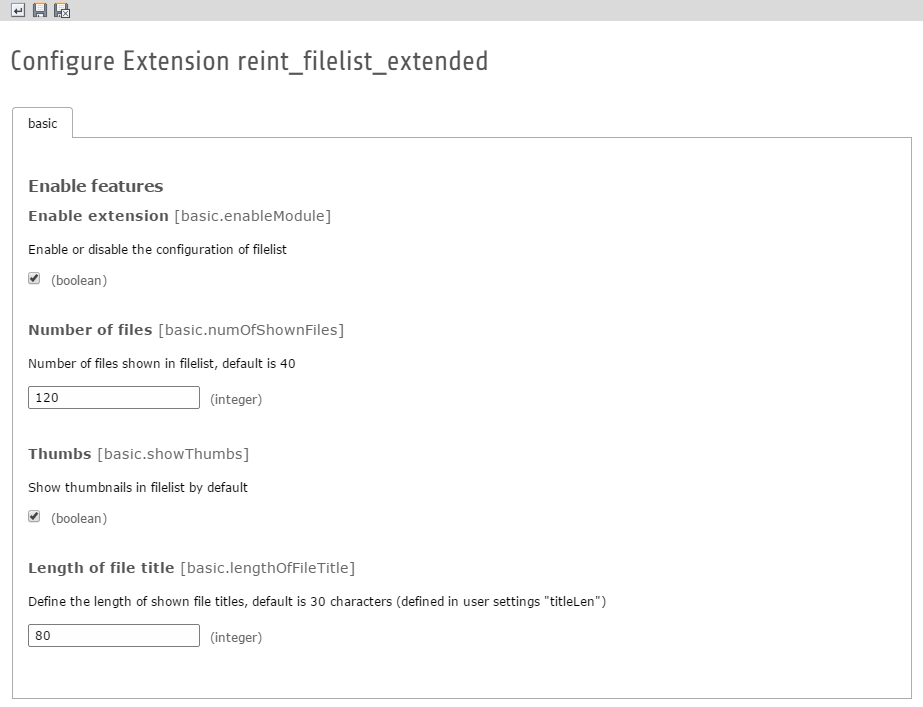

.. ==================================================
.. FOR YOUR INFORMATION
.. --------------------------------------------------
.. -*- coding: utf-8 -*- with BOM.

.. include:: ../Includes.txt

.. _admin-manual:

Administrator Manual
====================

Target group: **Administrators**

Install the extension in extension manager and user the configuration in extension manager to do your custom settings for the filelist.

For Composer-installations: Install via Composer with **composer require renolit/reint-filelist-extended**

There are the following options to configure:

- Enable or disable extension (enabled by default)
- Define the number of files shown on one page in filelist module (default is 40)
- Enable the thumbnails in filelist by default (default it isn't enabled)
- Define the length of a file title shown in file list before title will be cropped and appended with "..."

.. _screenshots2:

Screenshots
-----------

Screenshots of the extension manager where the configuration could be done.

   Configuration

   Where to find the configuration in extension manager

   Configuration of extension

   Configure the extension in extension manager
