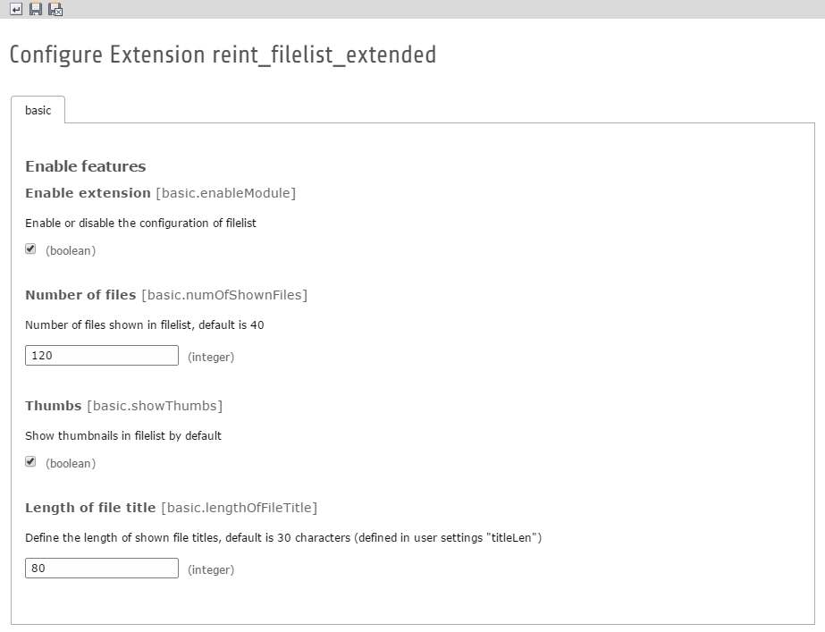

.. ==================================================
.. FOR YOUR INFORMATION
.. --------------------------------------------------
.. -*- coding: utf-8 -*- with BOM.

.. include:: ../Includes.txt

.. _introduction:

Introduction
============

.. _what-it-does:

What does it do?
----------------

Some options of filelist module are hard to configure for TYPO3 administrators or integrators.

This is a small extension to configure some options of filelist easier.

See Administrator/Index for all options you can set at the moment.

Read ToDoList/Index if you want to have more options.

.. _screenshots:

Screenshots
-----------

A screenshot of the extension manager where the configuration could be done.

   Configuration

   Configuration in extension manager
